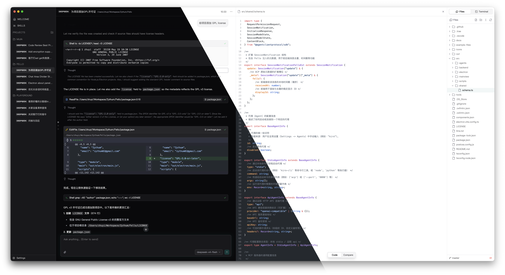

# 🚀 Fello — Your AI Desktop Companion

**Fello** is a desktop AI collaboration client built on the [**Agent Client Protocol (ACP)**](https://agentclientprotocol.com/).
It brings local and cloud AI agents into your development workflow — all inside a native desktop app.

**Fello** 是一款通过 [**ACP（Agent Client Protocol）**](https://agentclientprotocol.com/) 协议实现的桌面 AI 协作客户端，将本地与云端 AI Agent 无缝融入你的日常开发工作流。



[**⬇️ Download Fello**](https://github.com/Zythum/fello/releases)

---

## 📖 User Manual / 用户手册

🚀 [**Fello User Manual**](./guides/README.md) — Getting started, agent configuration, MCP setup, and more.

🚀 [**Fello 用户手册**](./guides/README.md) — 快速开始、Agent 配置、MCP 设置等完整指南。

---

## 🌟 Why Fello?

> **Talk to your codebase. Let AI handle the heavy lifting.**
> **与你的代码对话，让 AI 处理繁重工作。**

- **🧠 Multiple Agent Support** — Run local Stdio agents (via ACP, like `kiro-cli acp`) or connect to any OpenAI-compatible API. Switch freely between them per session.
- **🧠 多种 Agent 支持** — 运行本地 Stdio Agent（通过 ACP 协议，如 `kiro-cli acp`），或连接任意 OpenAI 兼容 API，会话间自由切换。

- **🔧 MCP Server Integration** — Dynamically attach Model Context Protocol servers (Stdio or HTTP) to supercharge your agent with extra tools.
- **🔧 MCP 服务器集成** — 动态配置 MCP 服务器（Stdio 或 HTTP），为 Agent 扩展更多能力。

- **📁 File Workspace + Terminal** — Browse, edit, preview files and run terminals side by side with your AI chat. All in one panel, all synced.
- **📁 文件工作区 + 终端** — 在 AI 对话旁浏览、编辑、预览文件，同时运行终端。一体面板，实时联动。

- **🌐 WebUI Remote Access** — Access your Fello from a browser on the same network. Full functionality, zero compromise.
- **🌐 WebUI 远程访问** — 在同网络的浏览器中远程使用 Fello 的全部功能，毫无妥协。

- **💬 WeChat iLink** — Connect Fello to WeChat. Receive messages, reply, and stay in the loop — right from your desktop.
- **💬 微信 iLink** — 将 Fello 接入微信，在桌面端收发消息，时刻在线。

- **⏰ Automation** — Schedule AI tasks with cron expressions. Let agents run on autopilot — daily reports, periodic checks, or any recurring workflow.
- **⏰ 自动化** — 通过 cron 表达式配置定时 AI 任务计划，让 Agent 自动执行日报生成、定期检查等重复性工作流。

- **🎨 Beautiful & Modern UI** — Dark/light themes, responsive layout, tabbed panels, and smooth streaming chat.
- **🎨 美观现代的界面** — 深色/浅色主题、响应式布局、标签面板、流畅的流式对话。

- **🛡️ Permission Control** — Granular tool permission with "Always Allow" memory. Stay in control, avoid repetitive approvals.
- **🛡️ 权限控制** — 细粒度的工具权限管理，支持"始终允许"记忆，掌控一切，免去重复确认。

---

## ✨ Features at a Glance

| Feature | Description |
|---------|-------------|
| **Local Agents** | Stdio agents via ACP protocol for private, offline-capable workflows |
| **API Agents** | Connect to OpenAI-compatible APIs (streaming text, reasoning, file content) |
| **MCP Servers** | Dynamic tool integration via Model Context Protocol |
| **File Tree** | Browse, create, rename, delete, drag-drop files — with preview for images, markdown, code, PDF, DOCX, XLSX |
| **Terminal** | Full xterm.js terminal with `node-pty`, multi-tab support, auto-persisted logs |
| **Diff View** | Side-by-side file diffing (Git-style) for code reviews |
| **WebUI** | Browser access over local network via WebSocket |
| **WeChat iLink** | Mobile ↔ Desktop messaging bridge |
| **Automation** | Cron-based scheduled AI tasks with file output and history tracking |
| **Skills** | Browse & install from [skills.sh](https://skills.sh) marketplace |
| **Chat Timeline** | Jump between messages with timeline dots |
| **Auto Titles** | Sessions auto-name themselves from your first message |
| **Multi-language** | English & Chinese (more locales extensible via i18next) |
| **Token Stats** | Real-time input/output/thinking token counters |

---

## 🔧 For Developers

### 🎯 Quick Start

```bash
# Install dependencies
# 安装依赖
npm install

# Launch in development mode
# 启动开发模式
npm run dev

# Build for production
# 构建生产版本
npm run build

# Package for your platform
# 打包为桌面应用
npm run pack:mac     # macOS
npm run pack:win     # Windows
npm run pack:linux   # Linux

# Package as npm package (headless server)
# 打包为 npm 包（无头服务器）
npm run pack:npm     # → npm-package/
```

> **Download the latest release** → [Releases](https://github.com/Zythum/fello/releases)

---

### 🖥️ Headless Server (npm package)

Run Fello as a pure Node.js server — no Electron, no display required. Perfect for Linux servers or CI environments.

```bash
# Via npx (no install needed)
npx @zythum02/fello-server --port 9090 --token mysecret

# Or install globally
npm install -g @zythum02/fello-server
fello-server -p 9090 -t mysecret

# Package locally
npm run pack:npm
cd npm-package
npm publish --access public
```

The server serves the same WEBUI frontend over HTTP/WebSocket, with full session/agent/file/terminal support.

#### WEBUI Authentication

When accessing the WEBUI in a browser:

1. Visit the provided URL with `?token=xxx` (e.g. `http://192.168.1.100:9090/?token=abc123`)
2. The server validates the token and sets a **session cookie** (`fello_token`)
3. Subsequent requests (JS, CSS, WebSocket, project files) authenticate via cookie
4. Page requests (`/`) always require `?token=` in the URL — cookie alone is not accepted for initial page loads
5. The cookie is a session cookie (no `Max-Age`), cleared when the browser closes

This means each browser session needs the token URL once; refreshing the page works as long as the browser is open.

#### Clipboard in HTTP

`navigator.clipboard` requires a secure context (HTTPS). When accessing WEBUI over plain HTTP, the app automatically falls back to `document.execCommand("copy")` for copy operations. Paste requires `navigator.clipboard.readText()` which has no HTTP fallback — the paste button is hidden when the API is unavailable.

---

### Tech Stack

- **Desktop Shell**: Electron
- **Renderer**: React + Vite + Tailwind CSS
- **AI Protocol**: [ACP (Agent Client Protocol)](https://agentclientprotocol.com/) SDK + AI SDK
- **State Management**: Zustand
- **i18n**: i18next + react-i18next
- **Terminal**: xterm.js + node-pty
- **Build**: electron-vite + electron-builder

### How HMR Works

`npm run dev` starts:

1. **Vite dev server** on `http://localhost:6234` with HMR enabled
2. **Electron** loads the renderer from the Vite dev server
3. React components update instantly without full page reload

Main/preload changes typically require restarting the dev process.

### Project Structure

```
├── src/
│   ├── shared/               # Typed IPC contracts & shared types
│   ├── agents/               # Agent session logic (ACP + MCP tools, permissions, system prompts)
│   ├── backend/              # IPC handlers, FS, Terminal, WebUI, Skills
│   │   ├── agents/           # Agent process spawners (stdio, API)
│   │   ├── automation/       # Cron scheduling & task execution
│   │   └── ilink/            # WeChat iLink integration
│   ├── electron/             # Electron main process
│   └── mainview/             # React app (components, routing, store, i18n, styles)
├── docs/                     # Architecture, guides, conventions
├── tools/                    # Build scripts
└── icons/                    # App icons
```

### Customization Points

| What | Where to Edit |
|------|---------------|
| React components | `src/mainview/` |
| Routing | `src/mainview/router.tsx` |
| i18n translations | `src/mainview/locales/*.json` |
| Window / lifecycle | `src/electron/main.ts` |
| Backend logic | `src/backend/backend.ts` + `src/backend/agent/agent-bridge.ts` |
| IPC bridge | `src/scripts/electron-preload/preload.ts`, `src/mainview/backend.ts` |
| IPC types | `src/shared/schema.ts` |
| Agent implementations | `src/agents/` + `src/backend/agents/` |
| Build config | `electron.vite.config.ts` |

### Scripts

```bash
npm run dev          # Development with HMR
npm run build        # Production build
npm run preview      # Preview built app
npm run lint         # Lint with oxlint
npm run typecheck    # TypeScript checking
npm run format       # Format with oxfmt

# Package
npm run pack:npm     # Build npm package → npm-package/
npm run pack:mac     # macOS .dmg
npm run pack:win     # Windows .exe
npm run pack:linux   # Linux .AppImage
```

### 📖 Developer Guide

- [Overview](./docs/overview.md)
- [Tech Stack](./docs/tech-stack.md)
- [Architecture](./docs/architecture.md)
- [Project Structure](./docs/project-structure.md)
- [Coding Conventions](./docs/coding-conventions.md)
- [Custom Events](./docs/custom-events.md)
- [IPC Protocol](./docs/ipc-protocol.md)
- [Built-in ACP Tools](./docs/builtin-tools.md)
- [Automation](./docs/automation.md)
- [Storage & Data](./docs/storage.md)

---

**Built with ❤️ by [Zythum](https://github.com/Zythum)** · GPL-3.0-or-later
